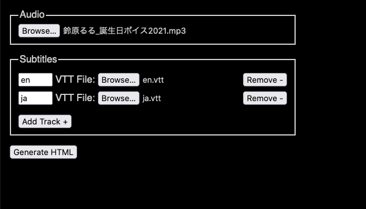

# Muku-Subs

Subtitle distribution for licensed audio media

Live demo: https://akiroz.github.io/muku-subs/

### How it works

This tool packages 1 or more subtitles (SRT or VTT format) into an HTML-based player
that validates the user-supplied original content before decrypting translations.

This way, only users who own the original content can access the subtitles.

### How to use

1. Download `muku-subs.html` and open it
2. Select the original audio media
3. Add the subtitle tracks with language code (ISO 2-letter, e.g. en/ja)
4. Click `Generate HTML`

